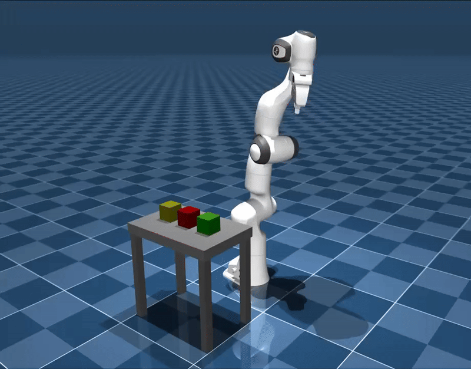

# **FailBench**: Simulating Robot Failures in MuJoCo

**FailBench** is a MuJoCo-based simulation framework designed to study how robots interact with their environments during **sudden unexpected failures** — such as **hardware shutdown**, **sensor degradation**, or **actuator malfunctions**. The goal is to systematically **understand failure-induced behaviors** and use this knowledge to develop **safer motion plans** or **robust learned policies**, depending on the control approach. By simulating and analyzing failure scenarios, **FailBench** helps inform decision-making strategies that proactively account for potential failure modes, ultimately improving robot safety and resilience during real-world missions.


---

## 🧭 Motion Planner

We implemented a custom planner that combines:

- **Rapidly-Exploring Random Tree (RRT)** for path planning  
- **Inverse Kinematics (IK)** via [Mink](https://github.com/kevinzakka/mink)  
- **MuJoCo-based collision checking**

This pipeline enables robust motion planning in cluttered environments with physical constraints.



---

## 🧠 Inverse Kinematics (IK) Wrapper

We provide a wrapper around [Mink](https://github.com/kevinzakka/mink) to interface with our MuJoCo simulation.

📄 [Read the IK wrapper documentation](docs/ik_docs.md)

---

## 🔧 Installation

Clone this repository and create a Conda virtual environment using the provided `environment.yml` file:

```bash
conda env create -f environment.yml
```

## 📦 Dependencies

- [MuJoCo 3.3.4](https://mujoco.org/)
- Python 3.10

All other required packages will be installed automatically when setting up the environment using `environment.yml`.


---

## 🙏 Acknowledgments

This project is inspired by and builds upon the excellent work of existing simulation platforms such as:

- [RoboCasa](https://robocasa.ai/)
- [Robosuite](https://robosuite.ai/)

We extend their design philosophies and modular stacks to focus specifically on simulating and understanding robotic failures.


---

## 📚 Citation

If you use this project or find it helpful, please consider citing the foundational work we build upon:

```bibtex
@inproceedings{[FAILBENCH2025],
  title={TBA},
  author={Duc M. Nguyen, Saad Ghani, Andrew Marshall, Allision Andreyev, and Xuesu Xiao},
  booktitle={TBA},
  year={2025}
}

---
## 📄 License

This project is licensed under the [MIT License](LICENSE).

